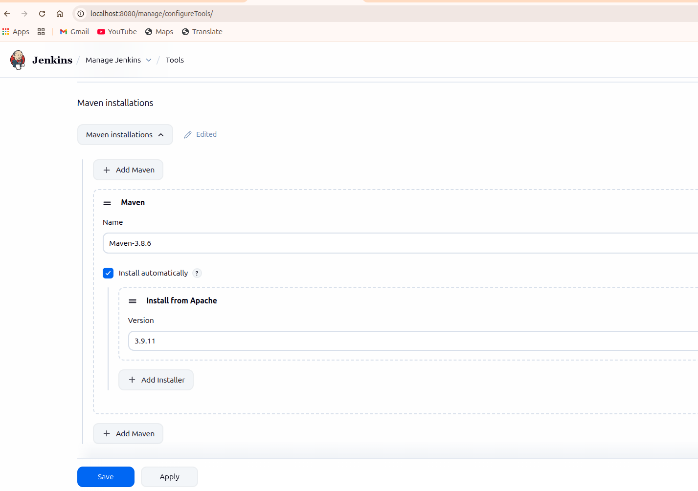
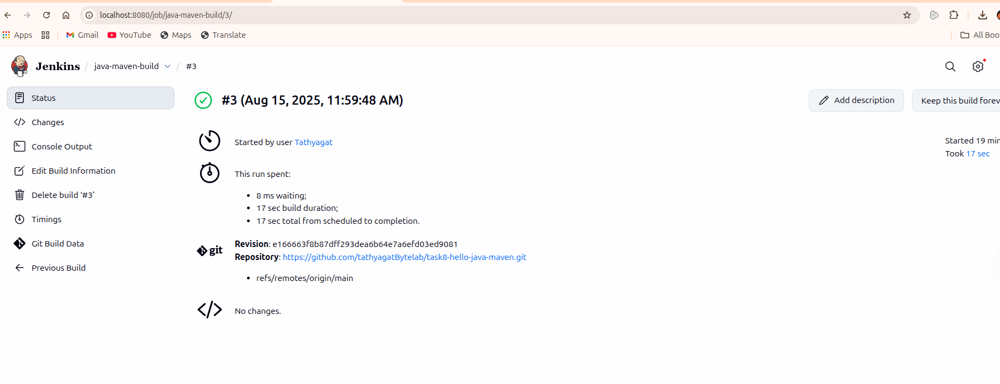
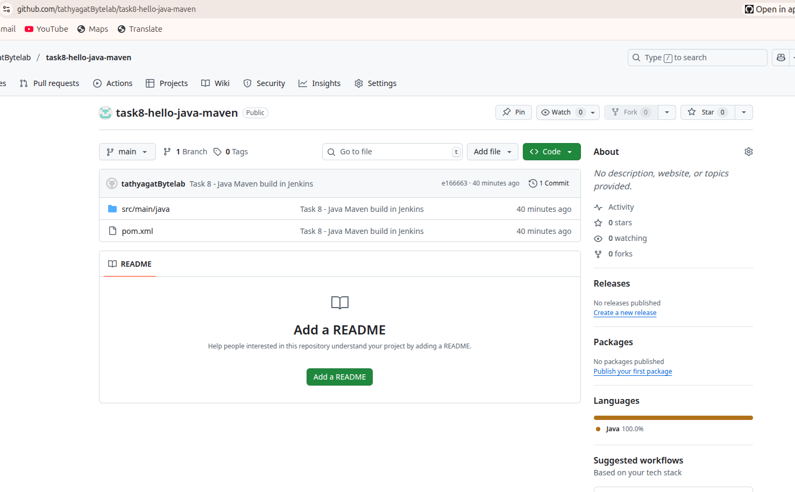

# 📦 Task 8 - Java Maven Build in Jenkins

##  Overview
This project demonstrates running a **Java Maven build job in Jenkins** as part of DevOps Internship Task 8.  
We created a simple Java "Hello, Jenkins + Maven!" application, packaged it using Maven, and built it in Jenkins through a Freestyle job.

---

## 🛠 Tools Used
- **Java JDK 8**
- **Maven 3.8.6**
- **Jenkins (LTS via Docker)**
- **Git & GitHub**

---

## Project Structure
```
task8-hello-java-maven/
├── pom.xml
├── src/
│   └── main/
│       └── java/
│           └── HelloWorld.java
├── screenshots/
│   ├── job-config.png
│   ├── build-success.png
│   └── github-repo.png
└── README.md
```

---

##  Steps Performed

### 1️2️⃣  Create Java Maven Project
- Created `HelloWorld.java`:
```
public class HelloWorld {
    public static void main(String[] args) {
        System.out.println("Hello, Jenkins + Maven!");
    }
}
```
- Added pom.xml with Maven compiler plugin for Java 1.8.

## 3️⃣  Configure Jenkins

Opened Jenkins at http://localhost:8080

Installed Maven under Manage Jenkins → Global Tool Configuration.

Created Freestyle Project:

Source Code Management: Git → Repo URL.

Build Step: Invoke top-level Maven targets → clean package.
## 4️⃣  Build and Verify
Triggered the build manually.

Maven compiled and packaged the JAR.
## 📸 Screenshots

- **Job Configuration**  
  [](screenshots/job-config.png)

- **Build Success Console Output**  
  [](screenshots/build-success.png)

- **GitHub Repository**  
  [](screenshots/github-repo.png)

